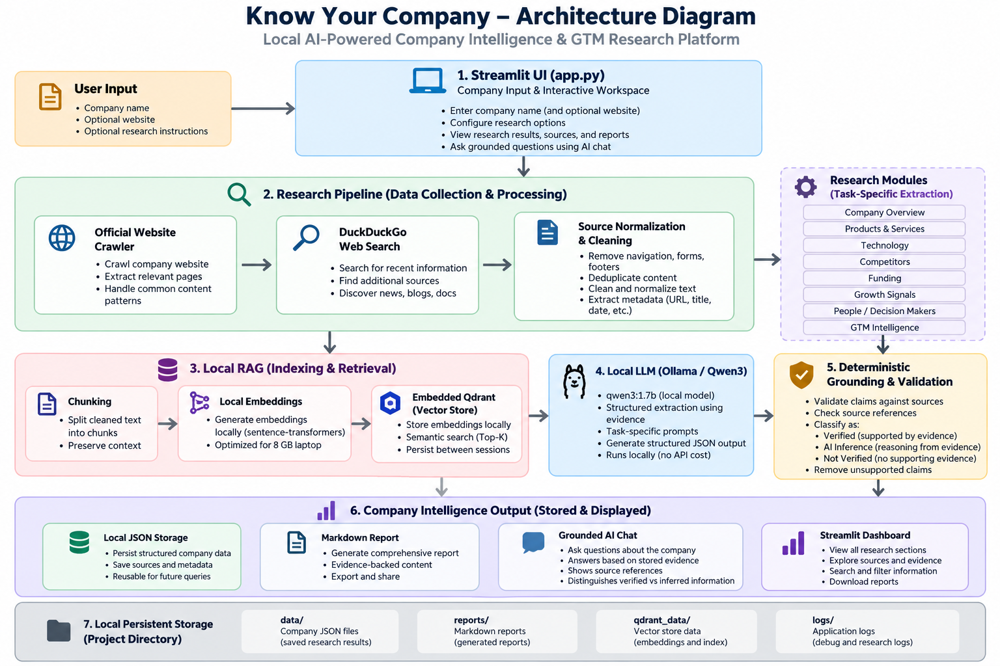
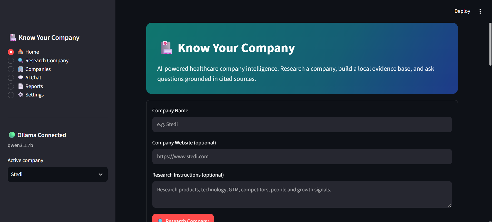
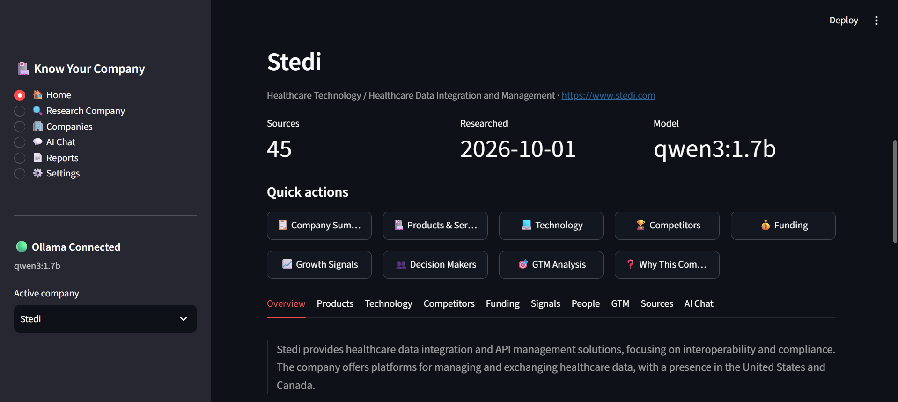
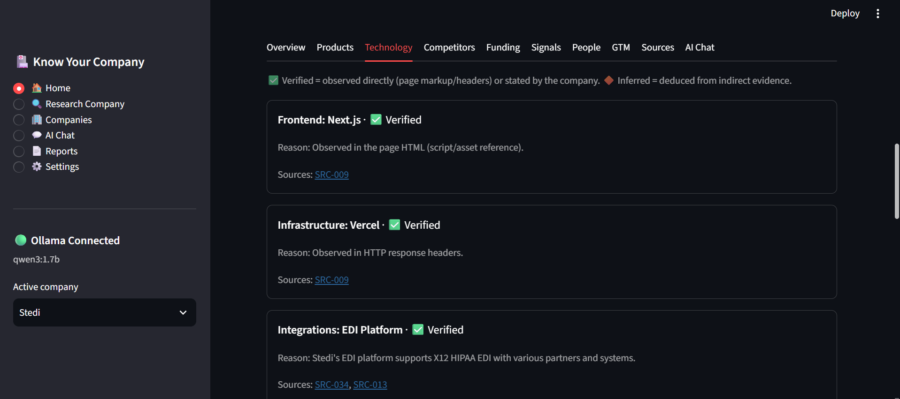
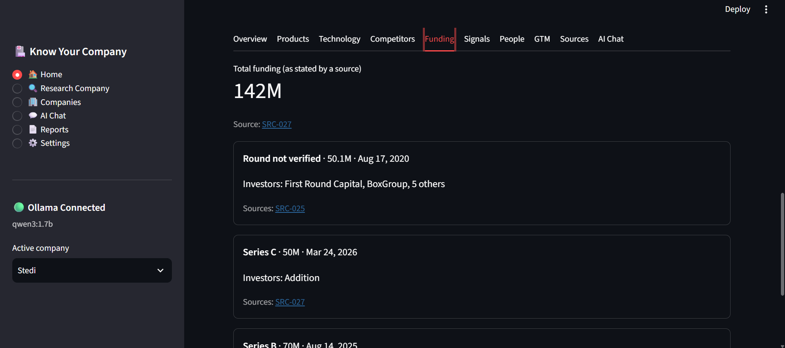
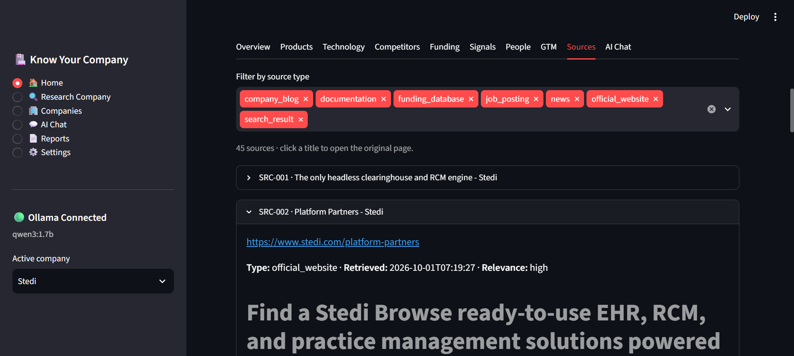
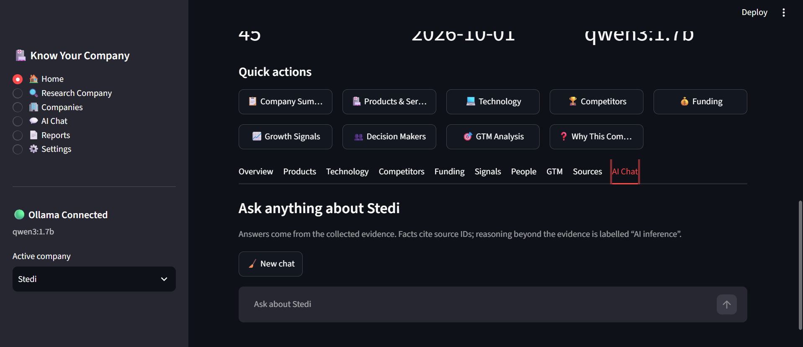

# 🏥 Know Your Company

**AI-powered company intelligence and GTM research platform — local, free, and source-grounded.**

Know Your Company is a locally hosted Streamlit application that researches a company from public web sources, converts the collected evidence into structured company intelligence, and provides grounded AI chat and reporting.

The project is designed for **company research, GTM intelligence, competitive research, and business analysis** — not clinical diagnosis or medical decision support.

> **Core principle:** **Search → Evidence → Index → Retrieve → LLM → Validate → Intelligence**

The system deliberately separates:
- **Verified** — supported by collected source evidence
- **AI Inference** — reasoning derived from the available evidence
- **Not verified** — information the available evidence did not support

---

## Why I Built This

Typical AI company-research workflows can become difficult to audit because a language model may produce plausible claims without preserving exactly where those claims came from.

Know Your Company was built around a different approach:

1. Collect public evidence first.
2. Preserve source IDs and source metadata.
3. Clean, de-duplicate, chunk, and index the evidence locally.
4. Retrieve relevant evidence for each research task.
5. Ask a local LLM to produce structured output from that evidence.
6. Apply deterministic Python grounding checks before saving the result.
7. Generate reports from the validated stored data rather than asking the LLM to write another free-form report.

This makes the system a **research pipeline with an AI reasoning layer**, rather than simply a chatbot.

---

## What It Does

Enter a company name and optionally provide its website or research instructions.

The application can research and organize:

- Company Overview
- Products & Services
- Technology
- Competitors
- Funding
- Growth Signals
- People / Decision Makers
- GTM Intelligence
- Sources / Evidence
- Grounded AI Chat
- Markdown Reports

---

## Prerequisites

Know Your Company is a local application. Cloning or downloading the
repository does not by itself install the external runtime requirements.

Before running the application, the system needs:

- Windows 11 or a compatible Windows environment
- Python 3.10+
- Ollama installed locally
- The `qwen3:1.7b` Ollama model
- Internet access for the initial Python dependency installation and
  public web research
- Sufficient RAM for local CPU-based inference

The project's `setup_windows.bat` script creates the Python virtual
environment and installs the required Python dependencies automatically.

Ollama and the Qwen3 model are separate prerequisites and are not bundled
inside the GitHub repository.

### Required setup

```cmd
setup_windows.bat
ollama pull qwen3:1.7b
run.bat
```

For detailed Ollama setup instructions, see
[`OLLAMA_SETUP.md`](OLLAMA_SETUP.md).

> **Note:** The repository does not include the Python virtual environment,
> Ollama installation, Ollama model files, downloaded embedding models, or
> runtime company data. These are created or downloaded locally during setup
> and execution.

---

## Architecture

The following diagram shows the main application flow, from company input and web research through local RAG retrieval, Ollama/Qwen3 analysis, grounding and validation, and the final company intelligence outputs.




## Screenshots

The following screenshots were captured from a real Stedi research run using
the local Know Your Company application.

### Research Input



The application accepts a company name, optional website, and research
instructions before starting the research pipeline.

### Company Overview



The company workspace summarizes the collected research and exposes the
different intelligence modules.

### Technology Evidence



Technology signals are separated into verified and inferred information,
with source references shown alongside the evidence.

### Funding



Funding information is presented with round details, dates, investors, and
associated source references.

### Source Evidence



The Sources view preserves the original research URLs and metadata, allowing
the collected evidence to be inspected directly.

### Grounded AI Chat



The AI Chat interface retrieves collected evidence before generating an
answer. Source-backed facts and AI inference are explicitly distinguished.

---

## Key Features

### 🔎 Public Web Research

- Official website crawling
- DuckDuckGo-based web search through `ddgs`
- Bounded research depth and query limits
- `robots.txt` awareness
- Source normalization and classification
- Duplicate paragraph removal
- Email and phone redaction

### 🧠 Local LLM

The default model is:

```text
qwen3:1.7b
```

Inference runs through **Ollama locally**, avoiding paid LLM APIs and API-key dependency.

The model is configurable through `.env` / application settings.

### 📚 Local RAG

Evidence is:

```text
cleaned
   ↓
chunked
   ↓
embedded
   ↓
stored in embedded Qdrant
   ↓
retrieved by company and relevance
```

The RAG layer uses:

- Sentence Transformers
- `BAAI/bge-small-en-v1.5`
- Embedded Qdrant
- Company-filtered retrieval
- Paragraph-aware chunking

A deterministic fallback embedding backend is also available when the primary embedding model cannot be loaded.

### 🛡️ Evidence Grounding

The LLM output is treated as a **proposal**, not as automatically trusted truth.

Examples of validation rules include:

| Intelligence | Grounding rule |
|---|---|
| Products | Product name must occur in cited evidence |
| Competitors | Competitor relationship must be supported by evidence |
| Technology | Directly observed/stated technologies can be Verified; other signals are Inferred |
| People | Person name and role must be supported together |
| Funding | Amounts, dates, round types and investors require supporting evidence |
| Funding totals | Never calculated by blindly summing rounds |
| Growth signals | Verified claims require meaningful overlap with evidence |
| GTM | Verified claims are derived from supporting evidence |
| Source IDs | Model-generated invalid IDs are rejected |
| Chat citations | Real retrieved source IDs are appended by the application |

**Important:** "Verified" means supported by the collected source evidence. It does not mean the source itself has been independently fact-checked.

### 💬 Grounded AI Chat

The chat layer retrieves relevant evidence before asking the local model to answer.

Responses expose:

- Answer
- Evidence
- AI inference
- Source list
- Retrieved evidence
- Retrieval scores

If relevant evidence cannot be retrieved, the system can report that the information was not verified instead of forcing an answer.

### 📄 Deterministic Reports

The Markdown report is generated from the **saved structured intelligence**.

The report layer does not ask the LLM to invent a second free-form research report.

This helps prevent the reporting stage from introducing claims that were not present in the validated data.

---

## Technology Stack

| Layer | Technology |
|---|---|
| UI | Streamlit |
| Language | Python |
| Local LLM | Ollama |
| Model | Qwen3 1.7B |
| Web Search | DuckDuckGo / `ddgs` |
| Website Parsing | Requests + BeautifulSoup |
| RAG | Custom retrieval pipeline |
| Embeddings | Sentence Transformers |
| Embedding Model | BAAI/bge-small-en-v1.5 |
| Vector Store | Embedded Qdrant |
| Data Models | Pydantic |
| Persistence | JSON + Markdown |
| Testing | Pytest + Streamlit testing |
| Runtime | Windows / local single-user workflow |

---

## Repository Structure

```text
know-your-company/
│
├── app.py
├── config.py
├── README.md
├── OLLAMA_SETUP.md
├── requirements.txt
├── requirements-dev.txt
├── pytest.ini
├── .env.example
├── .gitignore
├── setup_windows.bat
├── run.bat
│
├── ai/
│   ├── analyzer.py
│   ├── ollama.py
│   └── prompts.py
│
├── research/
│   ├── company.py
│   ├── products.py
│   ├── technology.py
│   ├── competitors.py
│   ├── funding.py
│   ├── signals.py
│   ├── people.py
│   ├── gtm.py
│   ├── pipeline.py
│   ├── web_search.py
│   └── website_parser.py
│
├── rag/
│   ├── chunker.py
│   ├── embeddings.py
│   ├── retriever.py
│   ├── sources.py
│   └── vector_store.py
│
├── models/
│   ├── company.py
│   ├── product.py
│   ├── technology.py
│   ├── competitor.py
│   ├── funding.py
│   ├── signal.py
│   ├── person.py
│   ├── gtm.py
│   └── source.py
│
├── storage/
│   ├── json_store.py
│   └── report.py
│
├── examples/
│   └── sample_company/
│
└── tests/
```

Runtime company data and local vector-store contents remain outside the public repository through `.gitignore`.

---

## Requirements

The project is designed for a local Windows workflow.

### Validated environment

The current implementation was validated locally with:

- Windows 11
- Python 3.13.2
- Ollama 0.35.0
- Qwen3 1.7B
- CPU inference
- Approximately 8 GB RAM
- Streamlit on `localhost:8501`

A small local model is recommended for machines with limited RAM.

---

## Installation

### 1. Clone the repository

```bash
git clone https://github.com/Aswin7M/know-your-company-platform-Aswin-M.git
cd know-your-company-platform-Aswin-M
```

### 2. Run Windows setup

```bat
setup_windows.bat
```

The setup script:

- Checks Python
- Creates `.venv`
- Installs runtime dependencies
- Creates local data directories
- Creates `.env` from `.env.example`

It does **not** download the Ollama model automatically.

### 3. Activate the environment manually if needed

Command Prompt:

```cmd
.venv\Scripts\activate
```

### 4. Install development dependencies

```cmd
.venv\Scripts\python.exe -m pip install -r requirements-dev.txt
```

---

## Ollama Setup

Install Ollama locally, then verify:

```cmd
ollama --version
```

Pull the default model:

```cmd
ollama pull qwen3:1.7b
```

Test it:

```cmd
ollama run qwen3:1.7b
```

The application expects Ollama at:

```text
http://localhost:11434
```

Default configuration:

```env
OLLAMA_BASE_URL=http://localhost:11434
OLLAMA_MODEL=qwen3:1.7b
```

See [`OLLAMA_SETUP.md`](OLLAMA_SETUP.md) for detailed setup and troubleshooting.

---

## Running the Application

### Windows

```bat
run.bat
```

### Or directly

```cmd
streamlit run app.py
```

Then open:

```text
http://localhost:8501
```

---

## How to Research a Company

1. Open the application.
2. Enter a company name.
3. Optionally provide its official website.
4. Optionally provide additional research instructions.
5. Start the research.
6. The application collects public evidence.
7. Evidence is cleaned, indexed, and stored locally.
8. Each intelligence module retrieves relevant evidence.
9. Ollama/Qwen3 produces structured analysis.
10. Python applies grounding checks.
11. Validated intelligence is stored.
12. The Streamlit workspace exposes the results.

The workspace contains:

```text
Overview
Products
Technology
Competitors
Funding
Signals
People
GTM
Sources
AI Chat
```

---

## Offline Sample Company

The repository includes a fictional sample company for testing:

```text
Northwind Health Clearinghouse (Sample)
```

Its evidence uses reserved `.example` URLs.

This allows the project to exercise the pipeline without relying on a real company or live web research.

---

## Real-World Validation — Stedi

The application was also tested against **Stedi** using the actual Windows environment, connected Ollama instance, and public web research.

Validation date:

```text
2026-10-01
```

Model:

```text
qwen3:1.7b
```

Observed output:

| Metric | Result |
|---|---:|
| Sources | 45 |
| Products | 6 |
| Technology signals | 11 |
| Competitors | 9 |
| Funding events | 3 |
| Growth signals | 8 |
| Named people | 2 |

The run produced a saved Markdown report and exposed the collected sources through the application's Sources tab.

The validation also demonstrated that the UI can distinguish directly supported technology from inferred signals, expose source-linked intelligence, preserve a failed leadership-search state rather than silently hiding it, and generate a deterministic report from the persisted structured data.

A copy of the validation report can be found in the project's documentation materials as `stedi-report.md`.

---

## Testing

Run the test suite with:

```cmd
pytest
```

The project also supports:

```cmd
python -m compileall .
```

The documented validation snapshot is:

```text
182 tests passed
0 tests failed
```

The test suite covers areas including:

- Pydantic models
- Source handling
- Chunking
- Embeddings
- Vector storage
- Retrieval
- Ollama client behavior
- Website parsing
- Search normalization
- Grounding rules
- Storage
- End-to-end sample-company flow
- Streamlit UI behavior

The tests use controlled/fake components where appropriate and do not require a paid API.

---

## Privacy & Local-First Design

The application is intentionally designed for local execution.

- No paid LLM API is required.
- No OpenAI/Anthropic/Groq/Gemini API key is required.
- LLM inference runs through local Ollama.
- Company research is stored locally.
- Runtime company data is excluded from Git through `.gitignore`.
- Local vector data is excluded from Git.
- `.env` is excluded from Git.
- Emails and phone numbers are redacted from collected text.
- LinkedIn is deliberately not fetched by the application.

The project is intended for a single-user local workflow and does not currently provide authentication or multi-user access control.

---

## Limitations

### Small local model

Qwen3 1.7B is practical for a constrained CPU/RAM environment, but small models can miss details or produce weaker reasoning than larger hosted models.

### Lexical grounding

Grounding checks are primarily evidence/word based. They reduce unsupported claims but cannot guarantee semantic correctness.

For example, a source could contain the same words as a generated statement while expressing a different interpretation.

### Retrieval limits

Only the most relevant retrieved chunks are provided to each analysis task. Information outside the retrieved context may therefore be missed.

### Web coverage

The research layer may have limited coverage for:

- JavaScript-heavy sites
- Paywalled content
- Login-only pages
- Some PDFs
- Rate-limited search results

### Performance

CPU-only research can take minutes because multiple structured model calls may be performed sequentially.

### Local vector store

Embedded Qdrant is intended for this local single-user architecture and is not designed here as a multi-user production database.

---

## Engineering Decisions

### Why Ollama?

It keeps the LLM boundary local and avoids dependence on paid API calls.

### Why Qdrant?

Embedded Qdrant provides vector similarity search without requiring a separate database service.

### Why RAG?

Company research can contain more information than a small model can reliably consume at once. Retrieval provides task-specific evidence while preserving source traceability.

### Why structured models?

Pydantic models make the intelligence layer explicit and allow deterministic normalization and validation instead of storing arbitrary LLM text.

### Why validate LLM output?

The LLM can fabricate source IDs, names, figures, or relationships. The application therefore treats model output as a proposal and checks it against the evidence before persistence.

### Why generate reports from stored data?

The reporting layer does not need another generative pass. Formatting validated structured data reduces the opportunity to introduce new unsupported claims.

---

## Current Status

**Know Your Company v1 — Local MVP**

| Area | Status |
|---|---|
| Core application | ✅ Complete |
| Streamlit UI | ✅ Complete |
| Local Ollama integration | ✅ Validated |
| Qwen3 1.7B | ✅ Validated |
| Web research | ✅ Validated |
| RAG pipeline | ✅ Complete |
| Grounding checks | ✅ Complete |
| Structured intelligence | ✅ Complete |
| Grounded chat | ✅ Complete |
| Deterministic reporting | ✅ Complete |
| Automated tests | ✅ 182 documented passing |
| Stedi real-world validation | ✅ Complete |
| GitHub publication | ✅ Complete |

---

## Roadmap

Possible future extensions include:

- LangGraph orchestration
- Multi-agent research workflows
- Incremental company re-research
- Change/signal tracking
- CRM integrations
- PostgreSQL + pgvector
- Authentication and multi-user support
- React-based frontend
- Stronger optional search providers
- Calibrated retrieval thresholds
- Larger local models where hardware permits

These are future directions rather than requirements for the current local MVP.

---

## Project Documentation

The repository's long-form technical documentation is maintained separately from this README.

Recommended documentation areas:

```text
docs/
├── architecture.md
├── research-lifecycle.md
├── grounding.md
├── testing.md
├── validation.md
├── examples/
│   └── stedi-report.md
└── screenshots/
    ├── 01-research-input.png
    ├── 02-company-overview.png
    ├── 03-technology-evidence.png
    ├── 04-funding.png
    ├── 05-source-evidence.png
    └── 06-grounded-ai-chat.png
```

The README is intended as the quick technical and portfolio entry point; the deeper documentation explains implementation details and validation history.

---

## Portfolio Summary

> **Know Your Company** is a local AI-powered company intelligence and GTM research platform built with Python, Streamlit, Ollama, Qwen3, RAG, Sentence Transformers, and embedded Qdrant. It collects public company evidence, indexes it locally, retrieves relevant context for structured analysis, validates LLM output against source evidence, and exposes the resulting intelligence through a Streamlit workspace, grounded chat, and deterministic Markdown reports.

---

## Author

**Aswin M**

GitHub: [@Aswin7M](https://github.com/Aswin7M)

Repository: [know-your-company-platform-Aswin-M](https://github.com/Aswin7M/know-your-company-platform-Aswin-M)

---

## License

This project is released under the MIT License. See [`LICENSE`](LICENSE).
